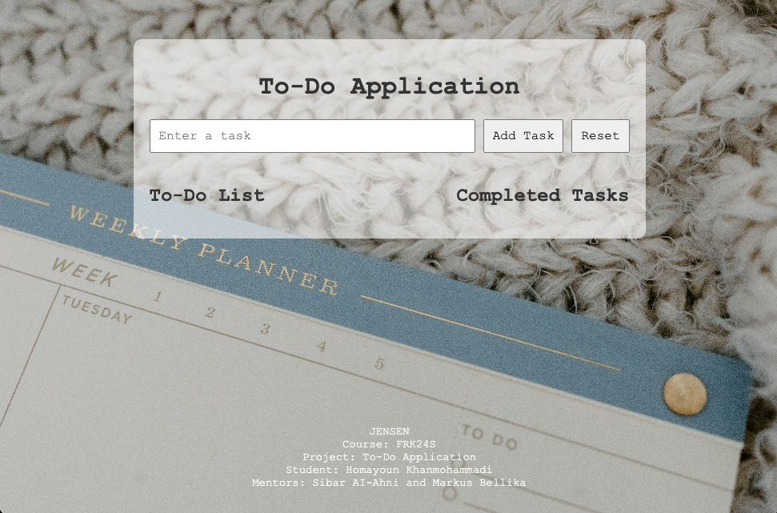
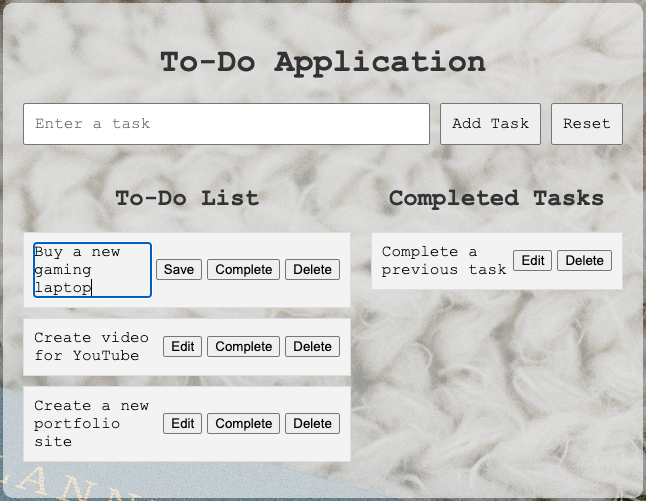
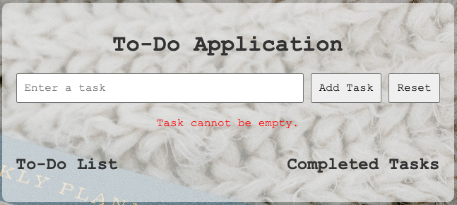

# 📝 To-Do Application

Welcome to my **To-Do Application** – a simple, user-friendly web app that helps you manage your daily tasks easily. This project was built as part of the *FRK24S* course at JENSEN.

---

## 🚀 Live Demo

🔗 [Click here to try the live version!](https://homa-x.github.io/To-Do-Application/)

---

## 📸 Screenshots

### 🏠 Home Page

### ✏️ Edit / Save / Complete / Delete / Reset Task

### ❌ Empty Task Error

---

## ⚙️ Features

- ➕ Add new tasks
- ✅ Mark tasks as completed
- 📝 Edit tasks inline
- 🗑️ Delete individual tasks
- 🔄 Reset all tasks with one click
- ❌ Error handling for empty inputs
- 📱 Responsive and minimal UI
- 🎨 Background image and monospace theme

---

## 🛠️ Built With

- HTML5  
- CSS3  
- JavaScript (Vanilla)  
- 💻 IDE: VS Code  

---

## 👨‍🎓 Student Info

- 👤 **Name:** Homayoun Khanmohammadi  
- 🏫 **School:** JENSEN  
- 📘 **Course:** FRK24S  
- 🧑‍🏫 **Mentors:** Sibar Al-Ahni & Markus Bellika  
- 🧑‍💻 **GitHub Profile:** [@Homa-X](https://github.com/Homa-X)

---

## 📂 Folder Structure

